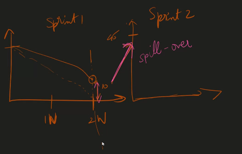

# The Software development life cycle

1.Planning

2. Analysis(Business analysis and technical analysis)

3. Design (Figma- vscode for designers,adobe xd, sketch)

4. Implementation
5. Testing & Integration

6.Maintenance

- The idea of design is to trace.
  design --> Code

Designing is a less time consuming job.(In figma)

(Auto layer,varience)--learn in figma

coolors - url(https://coolors.co/)

## Stakeholder

The people who are responsible for the mistakes happened in the project.

.png>)

System architect - Who setup the project initially .

Like.. should we use python or java .

If we dont have any java dev then doing the project in java is not possible. In this stage we handle the technical assignment of work.

Structure and importance of stackholders.

.png>)

.png>)

### service and product based

> product based---->lots of investement in r&d (multiple customers) replicated easily .  
> lots of time  
> example:netflix (its not a one time thing.)  
> service based: its a one time thing,it is customised for a particular need only.  
> its for particular customer.  
> they keep on changing languages.

## methodologies:

## waterfall model

6 months time
reqiurement is clear
planning is done u cant shift columns after wrds,things cannot be changed  
eg:construction of bridge...is permanent we cant change it again if we want.  
for suppose: u want to change from react to angular,without changing any requirement only structure is changed (technology migration in IT)
customer interaction is not there,,,,what is last output is .
2 realease

## agile

- everytime the cycle is keep on repeating regularly.
- monthly release is there to check waht is wrong.
- quickly make mistaken, learn from it and implememt again.
- deployements 3 times in day.
  2sprints in a month
  ( 1 sprint is 2 weeks)  
  ( 2 weeks for development  
  2 weeks for testin
  g)

## implementing agile:

-scrum is the implementation of agile.

- why agile:interaction with the customer

## implementation of agile:

## SCRUM

sprint planning---1hr
scrum master --assign the tasks.

the task which is assigned---story point.(fibannoci)(estimated days to complete the task)(ask seniors)( 1 2 3 5 8)days
standup---(10-15min)  
block-there are stuck in between without doing the task.  
sprint retrospective----what can be improved can be said.

## HOW TO RUN THE

- ONES CODE IS CHECKED BY ANOTHER VICE VERSA----PEER REVIEW
- WORK WHICH IS NOT DONE---BACKLOG(T0-DO)
- WHICH IS RUNNING RIGHTNOW---(IN PROGRESS)

## Difference between Waterfall and agile

.png>)

Waterfall - can be used when they are having .Clear requirements(Ex. Metro project)

Agile- can be used when they are having Unclear about the requirements.

.png>)

- The work done in the time period is called story points.

- T123 - It is called a ticket.

.png>)

> The story points are fibanocci number series.
>
> > 1,2,3,5,8,13

.png>)

peer review is the review within the team.

me checking aishu code and vice versa.

## Burn down chart

.png>)

## This is how an actual review chart should look like

- It is regarding the progress.
- this shows the continuous worlk
  .png>)

> > Kanban board is a tool to manage our scrum.

Spill oversharing the work left in one sprint to another sprint.

## In the review stage the reviewer checks the code quality.

revert-if we made a mistake in commit then we can make an another commit to undo that commit.

reset- chance to edit the commit

hard,soft - whole commit log will be deleted 

soft gives the chance to modify and commit the changes
