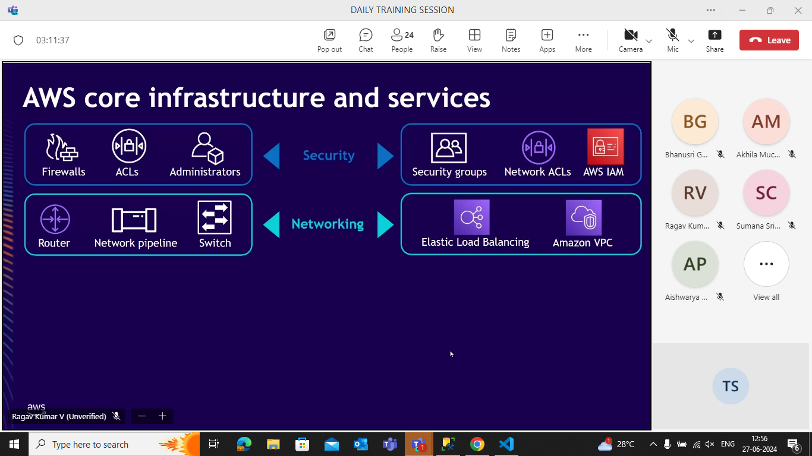

list has default padding
border,padding,margin doesnt inherit the parent qualities.the border applied to parent doesnt effect the children.

ctrl+shift+p -->gets emmet we need to put wrap.

- the paragraph tag uses a block display so they prints in new lines.Whereas the anchor tag (a) are inline so.. everything come in the same line.

- the span elements are also inline elements.

---

we cant install any software in google drive sooooo it is not cloud it is a storage provider.

if we buy cloud?

- high initial cost
- rent room to put the server setup
- air conditioners for making the server cool
- power bill
- maintenence(as it will be running it gets damages frequently)
- Spares (like backup monitor,motherboard)
- generator(for electricity)

## Disaster management

floods,earthquakes occuring situations we need a backup to a place where this disasters doesnt occur .

- some situations like fire accidents can be sudden .. so they need a backup.our backup will be in australia ...like soo

we choose the pc tools as dropdown.

cpu is a chip .the outer box is called cabinet.

What OS in cloud?

- LINUX
  The most used OS is linux accross the world.

Advantages of linux:
ditross: we r using is alpine linux it is just 256mb

the above r few destross used

- Free
- open source(linux is used my manyyyyy people like google,amazon etccc so if any bug is found then it can be modified by any developer coz their company system will be crashed .so they will develop / correct the bug.)
- secure
- small footprint(pay-per-use)
- automation(everything in linux is done through the command line)

## Scaling

Add more powerful cpu sooo we dont get any server down issues.(ex: during checking results) 
More strong cpu can accomadate many people.

Two types of scaling :

- vertical:upgrading the processes
- horizontal:

The load increases and the amount of pc's are also increased.

Here the upscaling and down scaling is available.

## Autoscaling (pay per use)

we pay as much as required.

when load becomes morethan 80% then it adds another pc.it load becomes lessthan 40% ten remove a pc.

How we get bankrupted ?

- DDOS
  

How to identify the attacking bots?

1. Finding the patterns of the attackers and finding the bots

2. Restricting the unrelated IP addresses.

---

RAM is 10000 times faster than Harddisk.
(RAM contain frequently asked data.)

- Harddisk is slow but permenent.
- RAM is faqst but temporary.

The info in the Harddisk should load into RAM which takes few seconds of time to load.

Soooo...to makes things faster we use a ssd instead of harddisk.

## WHY DATABASES?

1. Database- frequently asked info will have it in the RAM.(creates a copy in the ram)

2. Querying becomes easier

3. CRUD - easy

4. Backups are inbuilt

5. Undo - easily (it has limit)

6. Performance

- nosql databases are containing documents.
- 

The above are the relational databases.

redis is used onthe top of a relational sql.For example if we use mysql redis is uesd on top.

# AWS

- S3 is just to store things.
- As a country we dont use AWS coz we need to store confidential info like aadhar number ,pan number ....at the end it is a U.S company ..so security might effect.so we use our own servers.

## CDN(copy )

- whenever we put a request to the server .It fetches from different places.Which comes faster is wt we receive.

VPC-virtual connection

- Our Application is stored inside
  EC2(elastic cloud compute).
- EC2 is more flexible ...we can add RAM according to our requirement.

- We use Amazon S3 to store our photos and videos in the perspective of instagram.
  Coz Amazon S3 is cheap but sloww ...where as EC2 is fast but costly..so we comprimise for low cost.

- Amazon EBS(elastic block store) : long term storage memory,durability.we store our source code ,environment for our source code (i.e if node app we install node lik soo),os.. it is more faster

- Amazon dynamo DB : stores the tables ,info.

instead of sending the info individually to a person.We make a group with all the tasks then add the person.

- switch is used for extending the network.

the connection in the second floor acts like a switch.We need to connect the first floor with the isp(i.e colored once) and non colored once will be connected to the the non-colores once in second floor.

(that white box near wifi is called modem. It connects to the router and provides internet.)

the static is having a same ip soo our info is more secured.

- Amazon VPC : it handles the network.. i.e only
  the office net is eligible to access the databases.

amazon route 53 - for navigation...

1. It first checks whether the user is authenticated or not
2. It works as a firewall

Authentication - Who you are

Authorization - What you can do

- DNS part is handled by route 53

## Amazon S3

- In S3 we can also put our project online
- In real world configurations we dont use netlify..we use aws

we will have images in s3 it contains a url and that url is added to RDS .

Hosting--putting all the files in one place.

index.html is a static page it doesnt change until we make a modfication

the web server is used to manage the load .

- inside the app server the node js will be running...

if the node (app) crashes then no user can see the application ..there would be no effect the info coz we stored them in the database.But we loose the connection.

To overcome this crahes we need to restart the system...
Ex: Tomcat,apache...

The crashes can also happen whenever our code is faulty..

> The major advantage of app server is whenever a crash happens the app server automatically restarts....if we get multiple tries then we will be waiting for few seconds..

- Static files need web server
- ***

  steps:

S3

create bucket

give public access

acl enabled-(to make the files public to access)

create

add files

make them public by acl's

open the object url

we will get the page...(This is called Hosting)

when we want to store our file in s3 "https://yourbucketkit.s3.ap-south-1.amazonaws.com/task.html" this link is displayed...but if we want to simple like "Teja.com" Then we use (Amazon router 53)

- The route 53 will have that particular mapping..
  like BD.com is refered to that particular application.

The logs will be recorded individually.....like app1 's logs....app2's logs like sooooo........(Nikhils example)

public hosted zone--everybody can see
private hosted zone --for a particular region or zone is only accessable.

To create a domain:

- name of the s3 bucket is required.
- url of the s3 bucket

### COLD START

system is not on.

AWS Lambda:

- It is good when we have more users.
- It also follows auto scaling ....the problem is when no one is using it automatically shutdowns.
