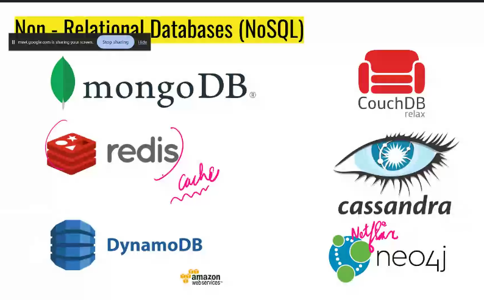

list has default padding
border doesnt inherit the parent qualities.the border applied to parent doesnt effect the children.
ctrl+shift+p -->gets emmet we need to put wrap .

- the paragraph tag uses a block display so they prints in new lines.Whereas the anchor tag (a) are inline so.. everything come in the same line.

- the span elements are also inline elements.

---

we cant install any software in google drive sooooo it is not cloud it is a storage provider.

if we buy cloud?

- high initial cost
- rent room to put the server setup
- air conditioners for making the server cool
- power bill
- maintenence(as it will be running it gets damages frequently)
- Spares (like backup monitor,motherboard)
- generator(for electricity)

## Disaster management

floods,earthquakes occuring situations we need a backup to a place where this disasters doesnt occur .

- some situations like fire accidents can be sudden .. so they need a backup.our backup will be in australia ...like soo

we choose the pc tools as dropdown.

cpu is a chip .the outer box is called cabinet.

What OS in cloud?

- LINUX
  The most used OS is linux accross the world.

Advantages of linux:
ditross: we r using is alpine

- Free
- open source(linux is used my manyyyyy people like google,amazon etccc so if any bug is found then it can be modified by any developer coz their company system will be crashed .so they will develop / correct the bug.)
- secure
- small footprint(pay-per-use)
- automation(everything in linux is done through the command line)

## Scaling

Add more powerful cpu sooo we dont get any server down issues.(ex: during checking results) 
More strong cpu can accomadate many people.

Two types of scaling :

- vertical
- horizontal

The load increases and the amount of pc's are also increased.

Here the upscaling and down scaling is available.

## Autoscaling (pay per use)

we pay as much as required.

when load becomes morethan 80% then it adds another pc.

How we get bankrupted ?

- DDOS
  

How to identify the attacking bots?

1. Finding the patterns of the attackers and finding the bots

2. Restricting the unrelated IP addresses.

---

RAM is 10000 times faster than Harddisk.
(RAM contain frequently asked data.)

- Harddisk is slow but permenent.
- RAM is faqst but temporary.

The info in the Harddisk should load into RAM which takes few seconds of time to load.

Soooo...to makes things faster we use a ssd instead of harddisk.

## WHY DATABASES?

1. Database- frequently asked info will have it in the RAM.(creates a copy in the ram)

2. Querying becomes easier

3. CRUD - easy

4. Backups are inbuilt

5. Undo - easily (it has limit)

6. Performance

- nosql databases are containing documents.
- 

The above are the relational databases.

