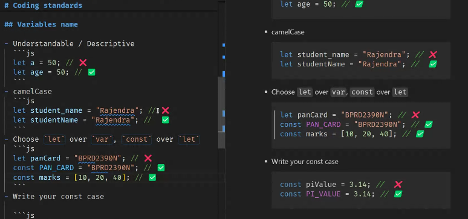
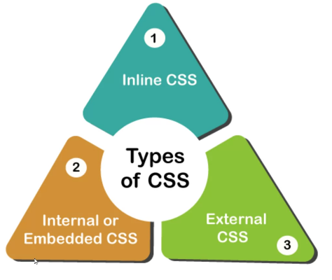
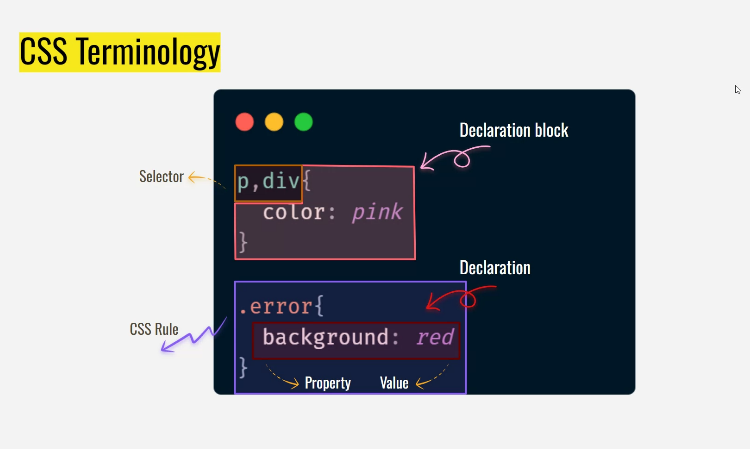
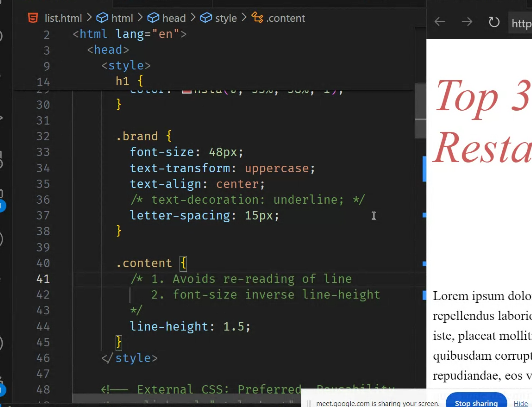
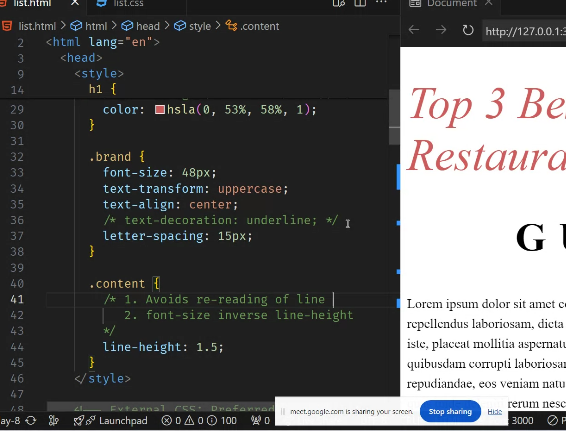

# Introduction to JS

> Intitial topics are data types,variable declarations

# Scope

> The scope is the lifetime of a variable i.e the range or a level where a variable is accessable.

- Var - Global scope
- Let ,Const - Block scope

### _ undefined is a value and not defined is a error._

## Type Conversion

- implicit conversion
- explicit conversion

> > The impicit is automatically done by the java script .

```js
var e = "5";
var t = 7;
console.log(e + t); //implicit conversion 57
console.log(e - t); //-2
console.log(typeof e); //string
```

In the above code the '+' operator can act as both concatenation and addition.

impicitly it does concatination into string.

> > To work it as addition we need to perform Explicit conversion.

```js
var e = "5";
var t = 7;
console.log(ParseInt(e) + t); //12
```

## Basic method combination

```js
[2,4,5]+"abc" // '2,4,5abc'
//It converts into string
[]+[] // ''
//It returns an empty string.
```

The multiplication operator try to convert the string into a number

```js
4 * "5"; // 20
4 * "5a"; // NaN
//the type conversion is not possible coz 5a is not a valid number
typeof NaN; //number
```

Which is Faster? Why?

```js
var e = "5";
var t = 5;
console.log(e == t); //True
console.log(e === t); //False
```

In the above scenario

The == works in 2 steps

- 5 =="5"
- Converts "5" -> 5
- Compares and it is true
  Concluding it by saying ,'==" allows the type conversion.

The === works in 1 steps

- 5 ==="5"
- That's it and it doesn't support type casting.
- since it doesn't allow any casting it does the work faster'

## Types of Function

1.Normal Function

```js
//Function definition/declaration
function double(n) {
  return n * 2;
}
//Function call
console.log(double(10));
```

What if we missed the return stmt

```js
//Function definition/declaration
function double(n) {
  n * 2;
}
//Function call
console.log(double(10));
```

In the above scenario it returns --Undefined.

There are two ways to end a function.

- return stmt

  > whenever return stmt is encountered then it stops the execution.

- Completion of the whole process

  > Completing the whole execution process

  2.Arrow Function

SYNTAX:

```js
const double = (n) => {
  return n * 2;
};
```

if the code is single line then the version can be written as

```js
const double = (n) => n * 2;
```

'n\*2' is our requred functionallity

> > Comparing with the Normal fnction the number of lines in the code will be less.

## DRY rules

```js
a1 = 9;
b1 = 4;
console.log(a1 + b1);

a2 = 2;
b2 = 0;
console.log(a2 + b2);

a3 = 3;
b3 = 8;
console.log(a3 + b3);
```

The above is a not a dry code

- DRY -Dont repeat yourself

The below code is dry ,reusable and is modular.

```js
const sum = (a, b) => a + b;
console.log(sum(3, 5));
console.log(sum(9, 6));
console.log(sum(2, 7));
```

Functions solve the DRY problems

## 5 Pillars of Code Quality

1. Readability - 75%

2. Maintainability - code debt(i.e saying will make the code more readable tmrw and the tmrw never comes )

3. Extensibility(Ability to extend the code easily)

4. Testability

5. Performance

## Copy by value & Copy by reference

If we copy normally.We get

```js
var q = [100, 400];
var w = [380, 780];
var e = [[q, w]];
console.log(e); //[ [100,400], [ 380,780 ] ]
```

So,to rectify this we use the spread operator

Copy by value

- Spread operator

```js
var q1 = [100, 300];
var q2 = [...q1]; //(copy by value)
var q3 = [60, ...q1, 90, 40];
console.log(q3); //[60,100,300,90,40]
```

```js
var t1 = [400, 500];
var t2 = [90, 80];

var t3 = [...t2, ...t1];
console.log(t3); //[90,80,400,500]
```

## Loops in js

- for

```js
const marks = [80, 90, 100];
for (let i = 0; i < marks.length; i++) {
  console.log("Index:", i, "Marks : ", marks[i]);
}
//output
Index: 0 Marks :  80
Index: 1 Marks :  90
Index: 2 Marks :  100
```

- for in

  This method is more readable and simple.

```js
const marks=[80,90,100]
    for(let i in marks)
    {
    console.log("Index:",i,"Marks : ",marks[i])
    }
    //output
Index: 0 Marks :  80
Index: 1 Marks :  90
Index: 2 Marks :  100
```

- for of

This method is more readable and cleaner but if we want to access the index it is not much preferable.

```js
const marks = [80, 90, 100];
for (let mark of marks) {
  console.log("Mark :", mark);
}
//output
Mark: 80;
Mark: 90;
Mark: 100;
```

### Task-1

```js
const cart = [
  { a: "apple", b: 0.5, c: 4 },
  { a: "banana", b: 0.25, c: 6 },
];
const items = [
  { a: "cherry", b: 0.75, c: 2 },
  { a: "bna", b: 1, c: 3 },
];

var e = [...cart, ...items];
console.log(e);
var result = 0;
for (let i of e) {
  result += i.b * i.c;
}
console.log(result)[
  //output
  ({ a: "apple", b: 0.5, c: 4 },
  { a: "banana", b: 0.25, c: 6 },
  { a: "cherry", b: 0.75, c: 2 },
  { a: "bna", b: 1, c: 3 })
];
8; // it is the multiple of b and c .
//the result is the sum of all
```

## Task 2

Question :
// Ex 2: Rating 4.7 and above | Recommendations List

```js
const books = [
  { title: "Infinite Jest", rating: 4.5, genre: "Fiction" },
  { title: "A Brief History of Time", rating: 4.8, genre: "Science" },
  { title: "The Catcher in the Rye", rating: 3.9, genre: "Fiction" },
  { title: "Sapiens", rating: 4.9, genre: "History" },
  { title: "Clean Code", rating: 4.7, genre: "Technology" },
];
let arr = [];
for (let i of books) {
  if (i.rating >= 4.7) {
    arr.push(i.title);
  }
}
console.log(arr)[
  //output
  ("A Brief History of Time", "Sapiens", "Clean Code")
];
```

## Task 3

Question:

expected output:
[{ id: 2, status: 'Promoted' }, { id: 3, status: 'Promoted' }, { id: 4, status: 'Promoted' }]

```js
const employes = [
  { id: 1, name: "Alice", grade: 78 },
  { id: 2, name: "Bob", grade: 85 },
  { id: 3, name: "Charlie", grade: 92 },
  { id: 4, name: "David", grade: 88 },
  { id: 5, name: "Eva", grade: 76 },
];

// This should output:
// [{ id: 2, status: 'Promoted' }, { id: 3, status: 'Promoted' }, { id: 4, status: 'Promoted' }]
let arr = [];
for (let i of employes) {
  if (i.grade >= 85) {
    // console.log("id :",i.id,"status : Promoted");
    arr.push({ id: i.id, status: "Promoted" });
  }
}
console.log(arr);
//output
0
:
{id: 2, status: 'Promoted'}
1
:
{id: 3, status: 'Promoted'}
2
:
{id: 4, status: 'Promoted'}
```

## Task 4

Question: Top1 movie title

```js
const movies = [
        { title: "Inception", ratings: [5, 4, 5, 4, 5] },
        { title: "Interstellar", ratings: [5, 5, 4, 5, 4] },
        { title: "Dunkirk", ratings: [4, 4, 4, 3, 4] },
        { title: "The Dark Knight", ratings: [5, 5, 5, 5, 5] },
        { title: "Memento", ratings: [4, 5, 4, 5, 4] },
      ];

    var sum1=0;
    let arr=[]
    let arr1=[]
  function fun(ratings)
  {
    for(let j of ratings)
      {
        sum1+=j

      }
      arr.push(sum1);
      sum1=0;
  }
  for(let i of movies)
    {
       fun(i.ratings)
       arr1.push(i.title)
  }
  var max=0;
  var e=0;
   for(let k=0;k<arr.length; k++)
    {
      if(arr[k]>arr[k+1])
        {
          max=arr[k];
          e=k;
        }
    }
    console.log(arr1[e]);
//output
The Dark Knight
```

## Object methods

To call the keys we have a syntax as:

```js
let salaries = {
  name: "ravi",
  age: 23,
  gender: "M",
};
Object.keys(salaries);
var e = Object.keys(salaries);
console.log(e);
//Output
["name", "age", "gender"];
```

To call the value we have a syntax as:

```js
let salaries = {
  name: "ravi",
  age: 23,
  gender: "M",
};
Object.values(salaries);
var e = Object.values(salaries);
console.log(e);
//Output
["ravi", 23, "M"];
```

## Trick Commands

ctrl+shift+p -> It opens all the commands(It is similar to a command pallete)

ctrl+ space -> auto complete

ctrl + click -> It redirects to the particular declaration.

## Template Literals

Interpolation Substitution : It makes our code more readable compared to the normal code method.

Without Interpolation substitution

```js
var movieUrl = (domain, genre, year) =>
  "http://" + domain + "?genere=" + genre + "&year=" + year;

console.log(movieUrl("imdb.com", "thriller", 2020));
```

With Interpolation substitution

```js
var movieUrl = (domain, genre, year) =>
  `http:// ${domain}?genere=${genre}&year= ${year}`;

console.log(movieUrl("imdb.com", "thriller", 2020));
```

In General JS doesnt support multiline execution.But it can be doneusing BACKTICKS.

```js
- ` ` -> These are back ticks
var e=`It makes our code more readable compared to the normal code method.`;
// This works

var t="It makes our code more readable compared to the normal code method.";
//This doesnt work
```

> Refactoring: It is similar to cleaning our room. Quality better & with the same functionality.

## Destructuring

- Array destructuring
  Destructuring stands for unpacking

  ```js
  var [t1, t2] = [100, 200];
  console.log(t1, t2);
  //output
  100 200

  var [t1,t2,t3]=[100,200];
   console.log(t1,t2,t3)
  //output
  100 200 undefined

  var [t1,t2,t3=80]=[100,200];
  console.log(t1,t2,t3)
  //here t3=80 is called as default value
  //output
  100 200 80
  ```

> The default value is only taken when t3 is undefined

```js
var [t1,t2,t3=80]=[100,200,500];
console.log(t1,t2,t3)
//output
100 200 500

var [t1,t2,t3=80]=[100,200,undefined];
console.log(t1,t2,t3)
//output
100 200 80

var [,t1,t2,t3=80]=[100,200,undefined];
console.log(t1,t2,t3) //output
200 undefined 80
```

> > This method is used to skip the values.This concept is called HOLES

```js
var [, , t1, t2, t3 = 80] = [100, 200, undefined];
console.log(t1, t2, t3); //undefined undefined 80
```

## Object destructuring

> The default value can be anything..number,object,etc..

- The object destructuring works on key-value based rather than the indexing.

```js
const {name,networth,power}={
  name:"Tony"
  house:🤠
  networth:🤑🤑🤑
  power:🦾

};
console.log(name);
console.log(networth);
console.log(power);
//output

Tony
🤑🤑🤑
🦾
```

> > The unpacking in array is done by indexing and the unpacking in Objects is done by Key considerations.

## The task1 code with refactoring by using object destruction

```js
const cart = [
  { name: "apple", price: 0.5, quantity: 4 },
  { name: "banana", price: 0.25, quantity: 6 },
];

const newItems = [
  { name: "Cherry", price: 0.75, quantity: 5 },
  { name: "Date", price: 1, quantity: 3 },
];

//   Ex 1.1: Combine cart + newItems
const comb = [...cart, ...newItems];

var result = 0;
for (let { price, quantity } of comb) {
  result = r price * quantity;
}
console.log("The Total Price of all fruits : " + result);
//output
10.25;
```

## ES features

> > Unary operator : ++,--,!
> > binary operator : 2+5, 6-2, 9\*7 7/2

# Code snippets

# Truthy vs falsy

```js
let x = [];
if (x) {
  console.log("Hey");
} else {
  console.log("NOpe");
}
//output
Hey;
```

```js
let x = [null];
if (x) {
  console.log("Hey");
} else {
  console.log("NOpe");
}
//output
Hey;
```

```js
let x = null;
if (x) {
  console.log("Hey");
} else {
  console.log("NOpe");
}
//output
Nope;
```

Logical OR

```js
var height = 150;
var final = 140 || height;
console.log(final);
//output
140;
//In logical OR if one /first value is true then it doen't check nxt one.
```

```js
var avgtemp = 20;
var temp = 0 || avgtemp;
console.log(temp);
//output
20;
//falsy values are followed here
```

> ?? - this only considers null and undefined as falsy remaining all are true.

```js
var avgtemp = 20;
var temp = 0 ?? avgtemp;
console.log(temp);
//output
0;
//for null and undefined falsy table is followed
```

# Coding standards

> Coding standards : Are ment to have uniformity throughout our code base

> Code quality

> DRY

# Variables name

- Understandable/descriptive

```js
let a=50 ❌
let age=50 ✅
```

- camelCase

```js
let studentname="Teja" ❌
let studentName="Teja"  ✅
```

- choose 'let' over 'var' ,'const' over 'let'

````js
let aadharno= 87654387654;❌
const aadharno= 87654387654; ✅
// coz aadhar is constant and doesnt change.
## Errors ( For variable name )

- Reserved keywords('if','for')
```js
let if="teja"; ❌
````

- Cannot start with numbers

```js
let 2ilu = "Teja"; ❌
```

- Cannot have special symbols except("\_")

```js
let abc$123= "avram";❌
let abc_123= "avram";✅
```



## Documentation

Single comment

```js
//
```

Multiple comment

```js
/*

*/
```

```js
/**
 *
 *
 *
 * /
 *
```

```js
/**
 * Multiplies two numbers.
 * @param {number} x - The first number.
 * @param {number} y - The second number.
 * @returns {number} The product of x and y.
 * @example
 * multiply(2, 3); // returns 6
 */
function multiply(x, y) {
  return x * y;
}
*/
```

> > This is called jsdoc

```js
// Write a function to make it uppercase.
/**
 *@param {string} name
 *@returns (string)
 *@example
 *toupper("Tejaswini");
 */
function toupper(name) {
  return name.toUpperCase();
}
```

```js
/**
 *
 * @param {*} name
 * @returns
 */
function toupper(name) {
  return name.toUpperCase();
}
//This structure works only above the function.
```

- ESlint is used to enforce the coding standards.

# CSS



Why we dont prefer inline . coz we dont want to make all combined and get confused. It doesn't gives the seperation of concern.

link tag for external css.

## The external CSS is always prefered.

## In some scenarios the internal css is given most preference coz to load the basic css of a page.



font - style --> type of the font italic or bold ...

1px == one dot on the screen

RGB
#cd5c5c
|

|

|
R G B

cd 5c 5c

HSL - saturation light

### over system can support good colors but the web doesn't support thatt good quality of colors.




