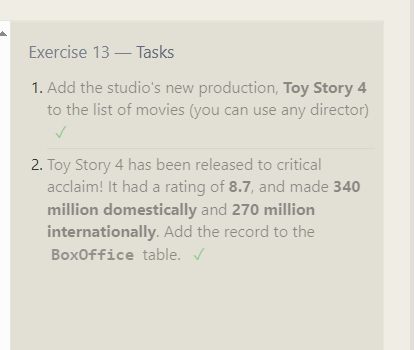
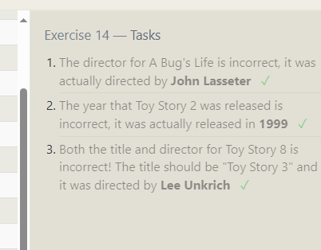
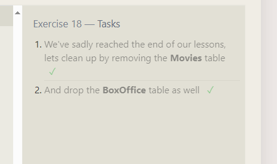
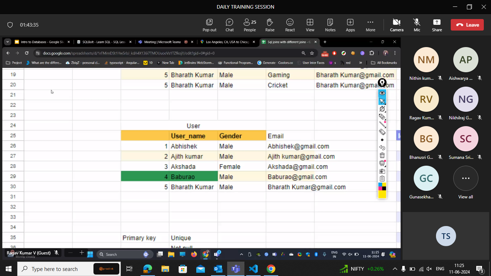
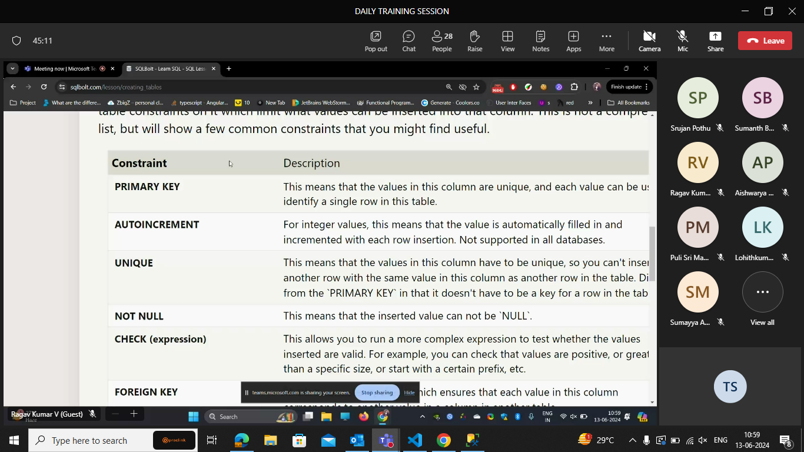
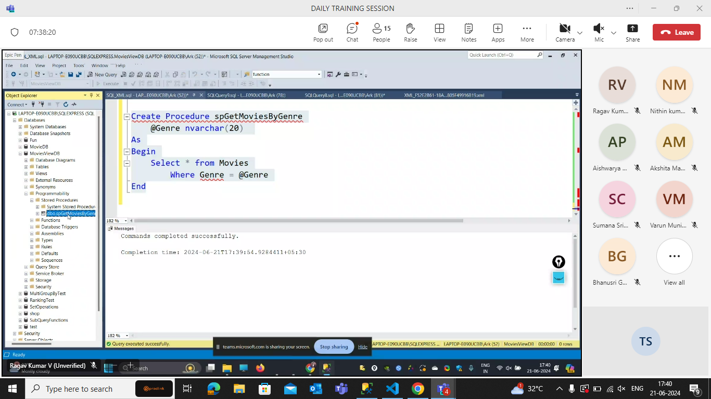

Exersise-1 tasks

Find the title of each film ✓

```sql
SELECT title FROM movies;
```

Find the director of each film ✓

```sql
SELECT director FROM movies;
```

Find the title and director of each film ✓

```sql
SELECT title,director FROM movies;
```

Find the title and year of each film ✓

```sql
SELECT year,title FROM movies;
```

Find all the information about each film ✓

```sql
SELECT * FROM movies;
```


Exercise-2 Tasks

Find the movie with a row id of 6 ✓

```sql
SELECT title FROM movies
Where id=6
```

Find the movies released in the years between 2000 and 2010

```sql
SELECT title FROM movies
Where year BETWEEN 2000 AND 2010
```

Find the movies not released in the years between 2000 and 2010

```sql
SELECT title FROM movies
Where year NOT BETWEEN 2000 AND 2010
```

Find the first 5 Pixar movies and their release year

```sql
SELECT title,year FROM movies
where id BETWEEN 1 AND 5
```


Exercise 3 — Tasks

Find all the Toy Story movies ✓

```sql
SELECT title FROM movies
where title LIKE"%toy%";
```

Find all the movies directed by John Lasseter

```sql
select title from movies
where director="John Lasseter"
```

Find all the movies (and director) not directed by John Lasseter

```sql
select title from movies
where director!="John Lasseter"
```

Find all the WALL-\* movies

```sql
select title from movies
where title LIKE"%WALL%"
```


Exercise 4 — Tasks

List all directors of Pixar movies (alphabetically), without duplicates ✓

```sql
SELECT DISTINCT director FROM movies
order by director ASC;
```

List the last four Pixar movies released (ordered from most recent to least)

```sql
SELECT title FROM movies
order by year desc limit 4;
```

List the first five Pixar movies sorted alphabetically

```sql
SELECT title FROM movies
order by title  limit 5;

```

List the next five Pixar movies sorted alphabetically

```sql
SELECT title FROM movies
order by title
limit 5
offset 5;

```


Review 1 — Tasks

List all the Canadian cities and their populations ✓

```sql
SELECT city,population FROM north_american_cities
where country="canada";
```

Order all the cities in the United States by their latitude from north to south

```sql
SELECT City FROM north_american_cities
where country="United States"
Order by latitude desc;
```

List all the cities west of Chicago, ordered from west to east

```sql
SELECT city FROM north_american_cities
where longitude<(select Longitude from  North_american_cities
where City="Chicago")
order by longitude;
```

List the two largest cities in Mexico (by population)

```sql
SELECT city FROM north_american_cities
where country="Mexico"
order by population desc
limit 2;

```

List the third and fourth largest cities (by population) in the United States and their population

```sql
SELECT city,population FROM north_american_cities
where country="United States"
order by population desc
limit 2
offset 2;
```


Exercise 6 — Tasks

Find the domestic and international sales for each movie ✓

```sql
SELECT title, domestic_sales, international_sales
FROM movies
  INNER JOIN boxoffice
    where movies.id = boxoffice.movie_id;
```

Show the sales numbers for each movie that did better internationally rather than domestically

```sql
SELECT title, domestic_sales, international_sales
FROM movies INNER JOIN boxoffice ON movies.id = boxoffice.movie_id
where international_sales > domestic_sales;
```

List all the movies by their ratings in descending order

```sql
SELECT title,rating
FROM movies INNER JOIN boxoffice ON movies.id = boxoffice.movie_id
order by rating desc;
```

Exercise 7 — Tasks
Find the list of all buildings that have employees ✓

```sql

```

Find the list of all buildings and their capacity ✓

```sql
SELECT DISTINCT building_name,capacity  FROM buildings LEFT JOIN employees
ON buildings.building_name= employees.building;
```

List all buildings and the distinct employee roles in each building (including empty buildings)

```sql
SELECT DISTINCT building_name,role  FROM buildings LEFT JOIN employees
ON buildings.building_name= employees.building;
```


Exercise 8 — Tasks

Find the name and role of all employees who have not been assigned to a building ✓

```sql
SELECT name,role FROM employees
where building IS NULL;
```

Find the names of the buildings that hold no employees

```sql
SELECT building_name FROM buildings left join employees on buildings.building_name=employees.building
where building IS  NULL;
```


Exercise 9 — Tasks

List all movies and their combined sales in millions of dollars ✓

```sql
SELECT title,(domestic_sales+international_sales) /1000000 as sum  FROM boxoffice
LEFT JOIN movies
on boxoffice.movie_id=movies.id;
```

List all movies and their ratings in percent

```sql
SELECT title, ROUND(rating /10*100) as percent  FROM boxoffice
LEFT JOIN movies
on boxoffice.movie_id=movies.id;
```

List all movies that were released on even number years

```sql
SELECT title FROM boxoffice
JOIN movies
on boxoffice.movie_id=movies.id
where year % 2 ==0;
```


Exercise 10 — Tasks

Find the longest time that an employee has been at the studio ✓

```sql
SELECT Max(Years_employed) FROM employees;
```

For each role, find the average number of years employed by employees in that role

```sql
SELECT role,avg(Years_employed) FROM employees
group by Role;
```

Find the total number of employee years worked in each building

```sql
SELECT building,sum(years_employed) FROM employees
group by building;
```


Exercise 11 — Tasks

Find the number of Artists in the studio (without a HAVING clause) ✓

```sql
SELECT count(role) FROM employees
where role="Artist";
```

Find the number of Employees of each role in the studio

```sql
SELECT role,count(role) FROM employees
group by role;
```

Find the total number of years employed by all Engineers

```sql
select sum(Years_employed) from employees
where Role="Engineer"
```


Exercise 12 — Tasks

Find the number of movies each director has directed ✓

```sql
SELECT director, count(director) FROM movies
group by director;
```

Find the total domestic and international sales that can be attributed to each director

```sql
SELECT director, SUM(domestic_sales + international_sales) as sum
FROM movies INNER JOIN boxoffice
        ON movies.id = boxoffice.movie_id
GROUP BY director;
```


Exercise 13 — Tasks

Add the studio's new production, Toy Story 4 to the list of movies (you can use any director) ✓

```sql
Insert into Movies(title,director) values("Toy Story 4","John Lasseter");

```

Toy Story 4 has been released to critical acclaim! It had a rating of 8.7, and made 340 million domestically and 270 million internationally. Add the record to the BoxOffice table.

```sql
Insert into Boxoffice(movie_id,Rating,Domestic_sales,International_sales)values(15,8.7,340000000,270000000);
```



Exercise 14 — Tasks

The director for A Bugs Life is incorrect, it was actually directed by John Lasseter ✓

```sql
update movies
set Director="John Lasseter"
where Title="A Bugs Life";
```

The year that Toy Story 2 was released is incorrect, it was actually released in 1999

```sql
update movies
set Year= 1999
where Title="Toy Story 2";
```

Both the title and director for Toy Story 8 is incorrect! The title should be "Toy Story 3" and it was directed by Lee Unkrich

```sql
UPDATE movies
SET title = "Toy Story 3", director = "Lee Unkrich"
WHERE id = 11;
```



Exercise 15 — Tasks

This database is getting too big, lets remove all movies that were released before 2005. ✓

```sql
Delete from movies
where Year<2005;
```

Andrew Stanton has also left the studio, so please remove all movies directed by him.

```sql
Delete from movies
where director="Andrew Stanton";
```


Exercise 16 — Tasks
Create a new table named Database with the following columns:
– Name A string (text) describing the name of the database
– Version A number (floating point) of the latest version of this database
– Download_count An integer count of the number of times this database was downloaded
This table has no constraints.

```sql
CREATE TABLE Database (
    Name Text,
    Version Float,
    Download_count Integer
);
```


Exercise 17 — Tasks
Add a column named Aspect_ratio with a FLOAT data type to store the aspect-ratio each movie was released in. ✓

```sql
Alter table movies
add Aspect_ratio FLOAT;
```

Add another column named Language with a TEXT data type to store the language that the movie was released in. Ensure that the default for this language is English.

```sql
Alter table movies
add Language TEXT
Default  English;
```


Exercise 18 — Tasks

We've sadly reached the end of our lessons, lets clean up by removing the Movies table ✓

```sql
drop table movies;
```

And drop the BoxOffice table as well
drop table movies;

```sql
drop table boxoffice;
```



## Why joins?


This type of representation of a table is not recommanded becoz?

- Storage issue and DRY

so we break the table into two tables.



- update anomoly

(if it is crashed in between the udate then half records are with old data and other half is with the new data).

so to overcome the anamolies we use multiple tables.


to connect the two tables we use injunction /mapping table.

### rules of primary key:

- unique
- not null
- one primary key for table

### Foriegn key:

- The foriegn key is ment to join two tables.
- can be null
- primary key of another table

After separation - normalized data
Before separation- denormalized data

## Normalization


The normalization forms are used to provide <big>safety</big> to the information in the table.

## 1NF

rule1-row data should not follow any order.


when one coloum cant be a primary key then we combine 2 coulums and create a primanry key ..which is called as composite key.


## 2NF : the non key attributes should entirely depend on the primary key.

- deletion anomoly
- insertion anamoly
  

here, if we want to update the rating it is sufficent to update it at one place.

Here,the non key attributes are:

- item_quantity
- player_rating


## 3NF

There should not be any dependencies between two non-key attributes.

or

### BCNF

every attribute in the table should depend on the key(primary key),the whole key.(The primary key should also depend on primary key).

question:


answer:


Player skill level is updated once and it will be directly updated.

### JOINS

#### Why joins?

- for safety to access


inner join- gets common items b/w a anb b

outer join(left) : common items of a and b anddd full info in A.

outer join(right) : common items of a and b anddd full info in B.

during execution the left join works ... so to use right join we reapply them.

after the inner join all the values comes.

## Inner join


## Left join


## Right join


## Full join


## Aggregate functions

## All the people are most intrested in The aggregate functions coz (in real world the <big> Dashboard</big> uses the aggregate which shows all the stats in that one page. )

- After groupby filtering is done by having clause.

- if we are changing the coloumn names then we mention that names
- if we r inserting in the same order given then no need to mention the coloumn names.

## DataTypes

- integer - for whole numbers
- boolean - for true or false
- float - it stores 3 precision values
- double - it stores 6 precision values
- real - 12bvalues

- charecter(num_chars) - it can store few charecters
- Varchar(num_chars) - it can store them like a sentence.

- text - it stores paragraphs
  instead of text we can use nvarchar(max) or varchar(max)
- date,datetime
- BLOB - To store binary data we use blob. The binary data includes(images,videos)- this is not recommended.

we will store the images by the path we r using.



### Forign key constrain

- first we should delete the foriegn key table and later we should remove the orginal table.

- if we try to delete the primary key table directly then the info in other table becomes ghoost data.


#### Actual datatypes available in our sql server


Varchar -

nVarChar - It is more easy to calculate. It supports multiple languages,symbols,and special charecters.


varchar stores a letters/emojis into 2 or more unicodes.


we used varchar(max) once upon a time to store more info. Now we are using <b>text</b>.


Decimal will be exact .(performance low)
Float will be approx which causes loss of information sometimes.(performance high)

use database name;// redirecting the databases.

### String functions:

- len

```sql
select len('teja') as namelength;
--4
```

-left

```sql
select left('teja','2') as namelength;
--te
```

- right

```sql
select right('teja','2') as namelength;
--ja
```

- substring

```sql
select substring('tejaswinisanala ',1,7) as namelength;
--tejaswi
```

- uppercase

```sql
select upper('teja') as namelength;
--TEJA
```

- lowercase

```sql
select lower('tEjA') as namelength;
--teja
```

- trim

```sql
select trim('                                                     tejaswinisanala                     ') as namelength;
--tejaswinisanala
```

> It trims the extra space .

- Ltrim

```sql
select Ltrim('                       tejaswinisanala                     ') as namelength;
--tejaswinisanala
```

- Rtrim

```sql
select Rtrim('                       tejaswinisanala                     ') as namelength;
--                       tejaswinisanala
```

- CharIndex

```sql
select CharIndex('e','tejaswinisanala') as namelength;
-- 2

select CharIndex('r','tejaswinisanala') as namelength;
--0
select CharIndex('E','tejaswinisanala') as namelength;
--2
```

- Replace

```sql
select Replace('tejaswinisanala','a','r') as namelength;
--tejrswinisrnrlr
```

- Concat

```sql
select Concat('tejaswinisanala','manaswini') as namelength;
--tejaswinisanalamanaswini
```

- Replicate

```sql
select Replicate('tejaswinisanala ','3') as namelength;
--tejaswinisanala tejaswinisanala tejaswinisanala
```

- reverse

```sql
select Reverse('tejaswinisanala') as namelength;
--alanasiniwsajet
```

### Mathematical Function

- Abs

```sql
select abs(-190987);
--190987
```

- power

```sql
select power(2,5);
--32
```

- Round

```sql
select Round(10.5675,2);
--10.5700
```

- Ceiling

```sql
select Ceiling(10.5);
--11
```

- floor

```sql
select floor(10.9);
--10
```

### Date functions

- GetDate

```sql
select GETDATE() as today
--2024-06-13 12:54:13.153
```

- DateAdd

```sql
--It returns the date after specific days
select dateadd(day,10,getdate())
--2024-06-23 12:58:04.357
```

- DateDiff

```sql
-- It returns the difference between the dates
select datediff(day,'2024-6-25','2024-10-27');
--124(days)
select datediff(hour,'2024-6-25','2024-10-27');
--2976(hours)
```

- Format

```sql
--There are many formats available in docx microsoft
select Format(GETDATE(), 'dd MM yyyy');
-- 13 06 2024
```

- DatePart(Extract the part from te date)

```sql
 --extracting a certain part from the date i.e like date ,month....

select datepart(month,getdate())--6
select datepart(day,getdate())--13
```

### Corelated sub query : reference with the outside query for inside query.


Compared to subqueries...join are much easy to understand.
but sub queries provide more readablity compared to joins.

## Multi join tables


### Grouping sets

> Used to combine multiple grouping select statements.
> 


Union all - it will be adding


instead of writing multiple select stmts we can use grouping sets.

```sql
select region,product_type,sum(sales_amount) from sales_data
group by GROUPING SETS(
            (region),
			(product_type),
		   (region,product_type)
		   );

select region,product_type,sum(sales_amount) from sales_data
group by GROUPING SETS(
		   (region,product_type)
		   );
```

> > If we put () in grouping sets then we get the sum of all the values.
> > grouping sets gives the flexibility to choose required attributes as a group.

We have two types:

- Rollup :it will be giving the values in a particular order.
  
- Cube : It will give the all possible combinations.
  

- rollupSimilar to if we gave n coloumns then the possible combinations are n+1.

- Cube we get 2power n combinations.

we choose rollup and cube when we want all combinations. we use grouping sets when we are specific with particular combinations.

Who do we rank ?

We use ranking functions


```sql
select region,product_type,sales_amount,Rank() OVER(Order by sales_amount desc) as Rankvalue
from sales_data
```


we can also partion the rank based on our requirement i.e base4d on region or product_type.

## Common table expression(CTE)

```sql
WITH Sales_CTE
AS
(
select  region,product_type,sum(sales_amount) as Totalsales,
Dense_Rank() OVER (Partition by region order by sum(sales_amount) desc) as densevalue from sales_data
group by region,product_type
)
SELECT * FROM Sales_CTE
where densevalue=1;
```


we should be imagining that as a new table and perform operations on it.

### How to work on running totals.

| TransactionID | Date       | ProductName | Category    | Price | StoreName     | City          | Country |
| ------------- | ---------- | ----------- | ----------- | ----- | ------------- | ------------- | ------- |
| 1             | 2024-04-01 | Laptop      | Electronics | 1200  | TechWorld     | San Francisco | USA     |
| 2             | 2024-04-01 | Smartphone  | Electronics | 800   | TechWorld     | San Francisco | USA     |
| 3             | 2024-04-02 | Jeans       | Apparel     | 40    | FashionFiesta | New York      | USA     |

### ER diagrams

.png>)

---


### Sql cross join


Cant use these in sql server.

Naturaljoin:

- no need to mention the condition.
  

The above is the syntax.

Equi JOIN:

- Must mention the condition
- the condition is always '='
  

natural vs equi:

- No syntax for both of them.
  

not only "=" we can mention anything in inner join .(which is not in equi join)

example(db)-cast and convert

```sql
select *,dbo.CalculateAge([Year]) as Age from movies
order by Age desc
offset 3 rows
fetch next 3 rows only;--syntax for offset and fetch in  and sql server.
```

## View

```sql
Create View vWLastdecade
As
select MovieId,Title,[Year] from movies
where [year] Between 2010 and 2020


select * from vWLastDecade;
```

- the view is a copy...and a virtual table.
- Whenever we try execute 'select \* from vWLastDecade;' then it directly executes the created view table which only retrives this decade info.
- for the complex statements ..to make them easy we create views soo it is easily readable.
- Abstraction(hiding the complex info)
- data security(we can put the orginaltable confidential and only give limited info in the view)

- we cant do dml commands in functions so we use store procedures.

## Stored Procedures


```sql
-- Stored Procedures
Declare @OrderAmount Decimal(10, 2) = 1500.00

If @OrderAmount > 1000
Begin
	Print 'Applying 10% discount'
End
Else
Begin
	Print 'No Discount'
End
```


```sql
Declare @Counter Int = 10

While @Counter > 0
Begin
	Print @Counter
	Set @Counter = @Counter - 1
End
```




mentioning the letters sp is called 'convention'.

- the inbuilt stored procedures are represented as sp_procedurename.
  

The default procedure

- sp_helptext returns the text inside the function.

source procedure executes the program line by line.
In subquery we cant use them.

---other example

functions declaration (another method)

## Scalar Function

scalar function is used as a parameter in the coloumn name.

- it returns only 1 value.

- ITVF doesnt need begin and end.
- we write evry thing in the return stmt

Multi statement is done with the modification on the new created table.

## 24-06-2024

Why we choose no sql database?

- they are fast retrival and storing of the information.


guy - sql

girl(Manu example)- no sql


in general in real world.. it should be more on retriving than storing info coz we will just see the reels or shorts i.e retrieval

- SQL is average in both storing and inserting.

There is a way to improve the reading speed in SQL.

## Indexing

- Tables will be indexing by primary key.

- We will group the indexes.
  
  in this above process the searching and number of checks would be easy.This is called clustered index.

The grouping of the numbers is done by indexing.

Table scan - for non primary keys

dis:

- the more we insert the slow retrevial we get.but the insertion or reading will be faster

Is there any database that provides better insertion and retrival?

- Its all about compromising.


If we dont have indexing then it will scan everything. i.e "Table Scan"

6th line in the above image is the no: of lines executed.
(i.e 1000000)


## We created the index


- The clustered index decides the table order.
- clustered (pk)
- nonclustered (non pk)

for creating a nonclustering indexes.

```sql
CREATE NONCLUSTERED INDEX naming_index
ON employees ([name])
```

The reterival of the name is improved by using this.


- see the execution time for the above email.


- see the execution time for the above name.

The backend work for the above nonclustered index


the cluster first sorts name wise and then compares with the clustered ones .

so becoz of this the no of lines execution reduced.

dis:

whenever we do an insert we r rebuilding the table again.
