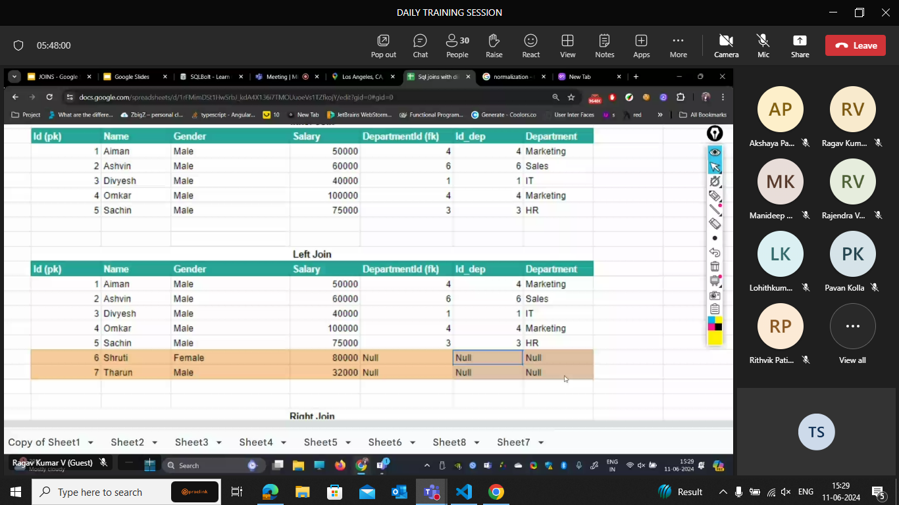

Exersise-1 tasks

Find the title of each film ✓

```sql
SELECT title FROM movies;
```

Find the director of each film ✓

```sql
SELECT director FROM movies;
```

Find the title and director of each film ✓

```sql
SELECT title,director FROM movies;
```

Find the title and year of each film ✓

```sql
SELECT year,title FROM movies;
```

Find all the information about each film ✓

```sql
SELECT * FROM movies;
```


Exercise-2 Tasks

Find the movie with a row id of 6 ✓

```sql
SELECT title FROM movies
Where id=6
```

Find the movies released in the years between 2000 and 2010

```sql
SELECT title FROM movies
Where year BETWEEN 2000 AND 2010
```

Find the movies not released in the years between 2000 and 2010

```sql
SELECT title FROM movies
Where year NOT BETWEEN 2000 AND 2010
```

Find the first 5 Pixar movies and their release year

```sql
SELECT title,year FROM movies
where id BETWEEN 1 AND 5
```


Exercise 3 — Tasks

Find all the Toy Story movies ✓

```sql
SELECT title FROM movies
where title LIKE"%toy%";
```

Find all the movies directed by John Lasseter

```sql
select title from movies
where director="John Lasseter"
```

Find all the movies (and director) not directed by John Lasseter

```sql
select title from movies
where director!="John Lasseter"
```

Find all the WALL-\* movies

```sql
select title from movies
where title LIKE"%WALL%"
```


Exercise 4 — Tasks

List all directors of Pixar movies (alphabetically), without duplicates ✓

```sql
SELECT DISTINCT director FROM movies
order by director ASC;
```

List the last four Pixar movies released (ordered from most recent to least)

```sql
SELECT title FROM movies
order by year desc limit 4;
```

List the first five Pixar movies sorted alphabetically

```sql
SELECT title FROM movies
order by title  limit 5;

```

List the next five Pixar movies sorted alphabetically

```sql
SELECT title FROM movies
order by title
limit 5
offset 5;

```


Review 1 — Tasks

List all the Canadian cities and their populations ✓

```sql
SELECT city,population FROM north_american_cities
where country="canada";
```

Order all the cities in the United States by their latitude from north to south

```sql
SELECT City FROM north_american_cities
where country="United States"
Order by latitude desc;
```

List all the cities west of Chicago, ordered from west to east

```sql
SELECT city FROM north_american_cities
where longitude<(select Longitude from  North_american_cities
where City="Chicago")
order by longitude;
```

List the two largest cities in Mexico (by population)

```sql
SELECT city FROM north_american_cities
where country="Mexico"
order by population desc
limit 2;

```

List the third and fourth largest cities (by population) in the United States and their population

```sql
SELECT city,population FROM north_american_cities
where country="United States"
order by population desc
limit 2
offset 2;
```


Exercise 6 — Tasks

Find the domestic and international sales for each movie ✓

```sql
SELECT title, domestic_sales, international_sales
FROM movies
  INNER JOIN boxoffice
    where movies.id = boxoffice.movie_id;
```

Show the sales numbers for each movie that did better internationally rather than domestically

```sql
SELECT title, domestic_sales, international_sales
FROM movies INNER JOIN boxoffice ON movies.id = boxoffice.movie_id
where international_sales > domestic_sales;
```

List all the movies by their ratings in descending order

```sql
SELECT title,rating
FROM movies INNER JOIN boxoffice ON movies.id = boxoffice.movie_id
order by rating desc;
```

Exercise 7 — Tasks
Find the list of all buildings that have employees ✓

```sql

```

Find the list of all buildings and their capacity ✓

```sql
SELECT DISTINCT building_name,capacity  FROM buildings LEFT JOIN employees
ON buildings.building_name= employees.building;
```

List all buildings and the distinct employee roles in each building (including empty buildings)

```sql
SELECT DISTINCT building_name,role  FROM buildings LEFT JOIN employees
ON buildings.building_name= employees.building;
```


Exercise 8 — Tasks

Find the name and role of all employees who have not been assigned to a building ✓

```sql
SELECT name,role FROM employees
where building IS NULL;
```

Find the names of the buildings that hold no employees

```sql
SELECT building_name FROM buildings left join employees on buildings.building_name=employees.building
where building IS  NULL;
```


Exercise 9 — Tasks

List all movies and their combined sales in millions of dollars ✓

```sql
SELECT title,(domestic_sales+international_sales) /1000000 as sum  FROM boxoffice
LEFT JOIN movies
on boxoffice.movie_id=movies.id;
```

List all movies and their ratings in percent

```sql
SELECT title, ROUND(rating /10*100) as percent  FROM boxoffice
LEFT JOIN movies
on boxoffice.movie_id=movies.id;
```

List all movies that were released on even number years

```sql
SELECT title FROM boxoffice
JOIN movies
on boxoffice.movie_id=movies.id
where year % 2 ==0;
```


Exercise 10 — Tasks

Find the longest time that an employee has been at the studio ✓

```sql
SELECT Max(Years_employed) FROM employees;
```

For each role, find the average number of years employed by employees in that role

```sql
SELECT role,avg(Years_employed) FROM employees
group by Role;
```

Find the total number of employee years worked in each building

```sql
SELECT building,sum(years_employed) FROM employees
group by building;
```


Exercise 11 — Tasks

Find the number of Artists in the studio (without a HAVING clause) ✓

```sql
SELECT count(role) FROM employees
where role="Artist";
```

Find the number of Employees of each role in the studio

```sql
SELECT role,count(role) FROM employees
group by role;
```

Find the total number of years employed by all Engineers

```sql
select sum(Years_employed) from employees
where Role="Engineer"
```


Exercise 12 — Tasks

Find the number of movies each director has directed ✓

```sql
SELECT director, count(director) FROM movies
group by director;
```

Find the total domestic and international sales that can be attributed to each director

```sql
SELECT director, SUM(domestic_sales + international_sales) as sum
FROM movies INNER JOIN boxoffice
        ON movies.id = boxoffice.movie_id
GROUP BY director;
```


---

## Why joins?


This type of representation of a table is not recommanded becoz?

- Storage issue and DRY

so we break the table into two tables.


- update anomoly

(if it is crashed in between the udate then half records are with old data and other half is with the new data).

so to overcome the anamolies we use multiple tables.


to connect the two tables we use injunction /mapping table.

### rules of primary key:

- unique
- not null
- one primary key for table

### Foriegn key:

- The foriegn key is ment to join two tables.
- can be null
- primary key of another table

After separation - normalized data
Before separation- denormalized data

## Normalization


The normalization forms are used to provide <big>safety</big> to the information in the table.

## 1NF

rule1-row data should not follow any order.


when one coloum cant be a primary key then we combine 2 coulums and create a primanry key ..which is called as composite key.


## 2NF : the non key attributes should entirely depend on the primary key.

- deletion anomoly
- insertion anamoly
  

here, if we want to update the rating it is sufficent to update it at one place.

Here,the non key attributes are:

- item_quantity
- player_rating


## 3NF

There should not be any dependencies between two non-key attributes.

or

### BCNF

every attribute in the table should depend on the key(primary key),the whole key.

question:


answer:


### JOINS

#### Why joins?


inner join- gets common items b/w a anb b

outer join(left) : common items of a and b anddd full info in A.

outer join(right) : common items of a and b anddd full info in B.

during execution the left join works ... so to use right join we reapply them.

after the inner join all the values comes.

## Inner join


## Left join



## Right join


## Full join


