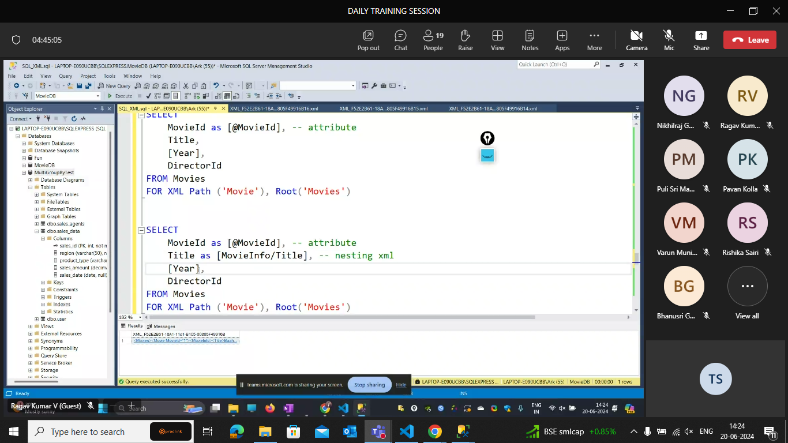
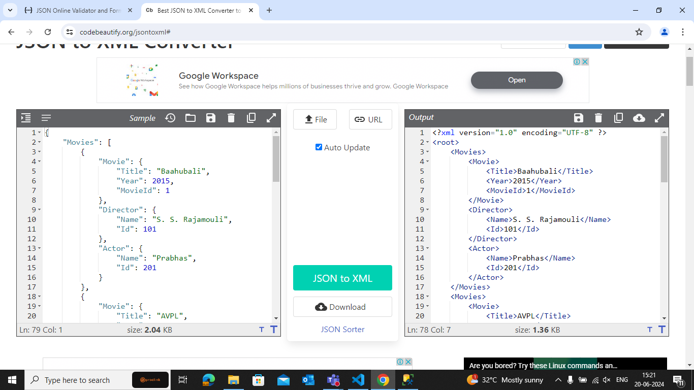
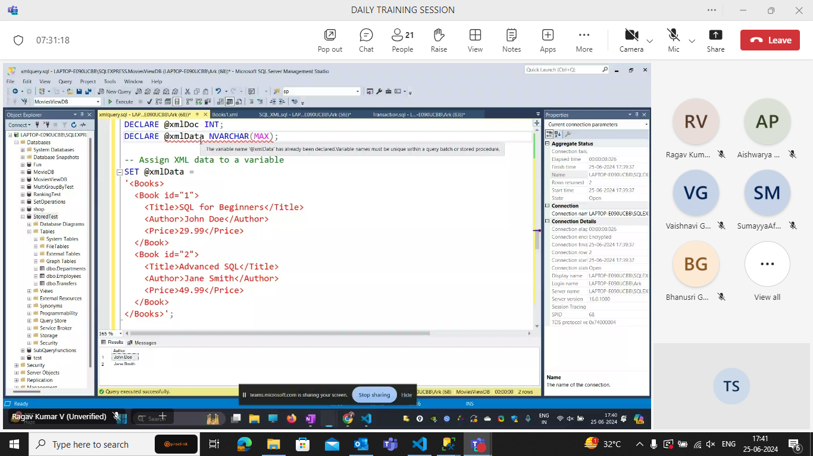
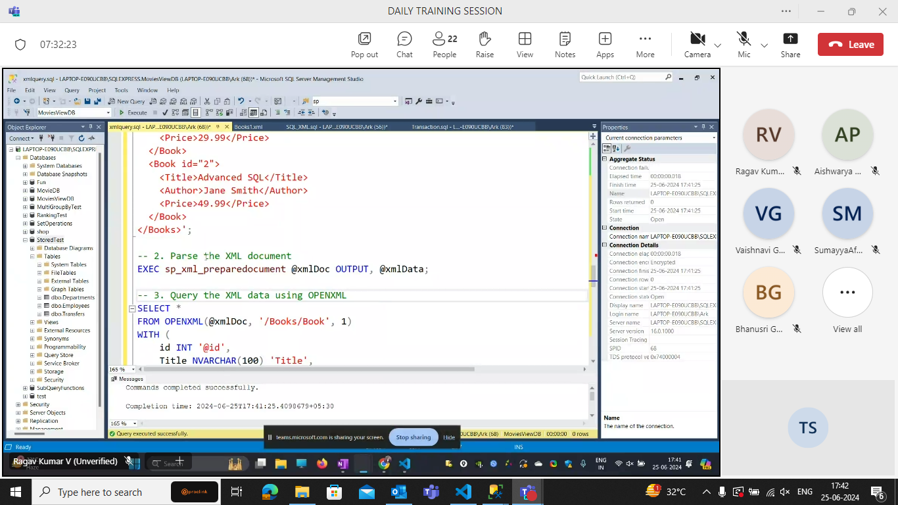

auto-attributes
path- keys

```sql
SELECT *

FROM Movies

FOR XML Auto

SELECT *

FROM Movies

FOR XML Path


SELECT

MovieId,

Title,

[Year],

DirectorId

FROM Movies

FOR XML Path

SELECT

	MovieId,

	Title,

	[Year],

	DirectorId

FROM Movies

FOR XML Path ('Movie')


SELECT

	MovieId,

	Title,

	[Year],

	DirectorId

FROM Movies

FOR XML Path ('Movie'), Root


SELECT

	MovieId,

	Title,

	[Year],

	DirectorId

FROM Movies

FOR XML Path ('Movie'), Root('Movies')


SELECT

	MovieId as [@MovieId], -- attribute

	Title as [MovieInfo/Title], -- nesting xml

	[Year] as [MovieInfo/Year],

	DirectorId

FROM Movies

FOR XML Path ('Movie'), Root('Movies')
```

---

## JSON



```sql

Select * from movies
for JSON Path
```

```json
[
  {
    "MovieId": 1,
    "Title": "Baahubali",
    "Year": 2015,
    "DirectorId": 101
  },
  {
    "MovieId": 2,
    "Title": "AVPL",
    "Year": 2020,
    "DirectorId": 102
  },
  {
    "MovieId": 3,
    "Title": "Pokiri",
    "Year": 2006,
    "DirectorId": 103
  },
  {
    "MovieId": 4,
    "Title": "Magadheera",
    "Year": 2009,
    "DirectorId": 101
  },
  {
    "MovieId": 5,
    "Title": "Srimanthudu",
    "Year": 2015,
    "DirectorId": 104
  },
  {
    "MovieId": 6,
    "Title": "Arjun Reddy",
    "Year": 2017,
    "DirectorId": 105
  },
  {
    "MovieId": 7,
    "Title": "Geetha Govindam",
    "Year": 2018,
    "DirectorId": 106
  },
  {
    "MovieId": 8,
    "Title": "Temper",
    "Year": 2015,
    "DirectorId": 103
  },
  {
    "MovieId": 9,
    "Title": "Eega",
    "Year": 2012,
    "DirectorId": 101
  },
  {
    "MovieId": 10,
    "Title": "Attarintiki Daredi",
    "Year": 2013,
    "DirectorId": 102
  }
]
```

```sql
Select * from movies
for JSON  Path, Root('Movies')
```

---

```json
{
  "Movies": [
    {
      "MovieId": 1,
      "Title": "Baahubali",
      "Year": 2015,
      "DirectorId": 101
    },
    {
      "MovieId": 2,
      "Title": "AVPL",
      "Year": 2020,
      "DirectorId": 102
    },
    {
      "MovieId": 3,
      "Title": "Pokiri",
      "Year": 2006,
      "DirectorId": 103
    },
    {
      "MovieId": 4,
      "Title": "Magadheera",
      "Year": 2009,
      "DirectorId": 101
    },
    {
      "MovieId": 5,
      "Title": "Srimanthudu",
      "Year": 2015,
      "DirectorId": 104
    },
    {
      "MovieId": 6,
      "Title": "Arjun Reddy",
      "Year": 2017,
      "DirectorId": 105
    },
    {
      "MovieId": 7,
      "Title": "Geetha Govindam",
      "Year": 2018,
      "DirectorId": 106
    },
    {
      "MovieId": 8,
      "Title": "Temper",
      "Year": 2015,
      "DirectorId": 103
    },
    {
      "MovieId": 9,
      "Title": "Eega",
      "Year": 2012,
      "DirectorId": 101
    },
    {
      "MovieId": 10,
      "Title": "Attarintiki Daredi",
      "Year": 2013,
      "DirectorId": 102
    }
  ]
}
```

---

```sql
select
   Movies.Title as 'Movie.Title',
   Movies.[Year] as 'Movie.Year',
   Movies.MovieId as 'Movie.MovieId',
   Director.[Name] as 'Director.Name',
   Director.DirectorId as 'Director.Id',
   Actor.[Name] as 'Actor.Name',
   Actor.ActorId as 'Actor.Id'
   from Movies INNER JOIN Director  on Movies.DirectorId=Director.DirectorId
   INNER JOIN MovieActors on Movies.MovieId= MovieActors.MovieId
   INNER JOIN Actor on MovieActors.Actorid=Actor.ActorId
   FOR JSON Path, Root ('Movies')
```

```json
{
  "Movies": [
    {
      "Movie": {
        "Title": "Baahubali",
        "Year": 2015,
        "MovieId": 1
      },
      "Director": {
        "Name": "S. S. Rajamouli",
        "Id": 101
      },
      "Actor": {
        "Name": "Prabhas",
        "Id": 201
      }
    },
    {
      "Movie": {
        "Title": "AVPL",
        "Year": 2020,
        "MovieId": 2
      },
      "Director": {
        "Name": "Trivikram Srinivas",
        "Id": 102
      },
      "Actor": {
        "Name": "Allu Arjun",
        "Id": 202
      }
    },
    {
      "Movie": {
        "Title": "Pokiri",
        "Year": 2006,
        "MovieId": 3
      },
      "Director": {
        "Name": "\tPuri Jagannadh",
        "Id": 103
      },
      "Actor": {
        "Name": "Mahesh Babu",
        "Id": 203
      }
    },
    {
      "Movie": {
        "Title": "Magadheera",
        "Year": 2009,
        "MovieId": 4
      },
      "Director": {
        "Name": "S. S. Rajamouli",
        "Id": 101
      },
      "Actor": {
        "Name": "Ram Charan",
        "Id": 204
      }
    },
    {
      "Movie": {
        "Title": "Srimanthudu",
        "Year": 2015,
        "MovieId": 5
      },
      "Director": {
        "Name": "Koratala Siva",
        "Id": 104
      },
      "Actor": {
        "Name": "Mahesh Babu",
        "Id": 203
      }
    }
  ]
}
```

```sql
select
   Movies.Title as 'Movie.Title',
   Movies.[Year] as 'Movie.Year',
   Movies.MovieId as 'Movie.MovieId',
   Director.[Name] as 'Director.Name',
   Director.DirectorId as 'Director.Id',
   Actor.[Name] as 'Actor.Name',
   Actor.ActorId as 'Actor.Id'
   from Movies INNER JOIN Director  on Movies.DirectorId=Director.DirectorId
   INNER JOIN MovieActors on Movies.MovieId= MovieActors.MovieId
   INNER JOIN Actor on MovieActors.Actorid=Actor.ActorId
   FOR JSON Path, Root ('Movies')
```

```json
{
  "Movies": [
    {
      "Movie.Title": "Baahubali",
      "Movie.Year": 2015,
      "Movie.MovieId": 1,
      "Director": [
        {
          "Director.Name": "S. S. Rajamouli",
          "Director.Id": 101,
          "Actor": [
            {
              "Actor.Name": "Prabhas",
              "Actor.Id": 201
            }
          ]
        }
      ]
    },
    {
      "Movie.Title": "AVPL",
      "Movie.Year": 2020,
      "Movie.MovieId": 2,
      "Director": [
        {
          "Director.Name": "Trivikram Srinivas",
          "Director.Id": 102,
          "Actor": [
            {
              "Actor.Name": "Allu Arjun",
              "Actor.Id": 202
            }
          ]
        }
      ]
    },
    {
      "Movie.Title": "Pokiri",
      "Movie.Year": 2006,
      "Movie.MovieId": 3,
      "Director": [
        {
          "Director.Name": "\tPuri Jagannadh",
          "Director.Id": 103,
          "Actor": [
            {
              "Actor.Name": "Mahesh Babu",
              "Actor.Id": 203
            }
          ]
        }
      ]
    },
    {
      "Movie.Title": "Magadheera",
      "Movie.Year": 2009,
      "Movie.MovieId": 4,
      "Director": [
        {
          "Director.Name": "S. S. Rajamouli",
          "Director.Id": 101,
          "Actor": [
            {
              "Actor.Name": "Ram Charan",
              "Actor.Id": 204
            }
          ]
        }
      ]
    },
    {
      "Movie.Title": "Srimanthudu",
      "Movie.Year": 2015,
      "Movie.MovieId": 5,
      "Director": [
        {
          "Director.Name": "Koratala Siva",
          "Director.Id": 104,
          "Actor": [
            {
              "Actor.Name": "Mahesh Babu",
              "Actor.Id": 203
            }
          ]
        }
      ]
    }
  ]
}
```

XML Table


adding the data to a variable.


```sql
DECLARE @xmlDoc INT;
DECLARE @xmlData NVARCHAR(MAX);

-- 1. Assign XML data to a variable
SET @xmlData =
'<Books>
<Book id="1">
<Title>SQL for Beginners</Title>
<Author>John Doe</Author>
<Price>29.99</Price>
</Book>
<Book id="2">
<Title>Advanced SQL</Title>
<Author>Jane Smith</Author>
<Price>49.99</Price>
</Book>
</Books>';

-- 2. Parse the XML document
EXEC sp_xml_preparedocument @xmlDoc OUTPUT, @xmlData;

-- 3. Query the XML data using OPENXML
SELECT *
FROM OPENXML(@xmlDoc, '/Books/Book', 1)
WITH (
    id INT '@id',
    Title NVARCHAR(100) 'Title',
    Author NVARCHAR(100) 'Author',
    Price DECIMAL(10,2) 'Price'
);

-- Clear the memory
EXEC sp_xml_removedocument @xmlDoc;
```
